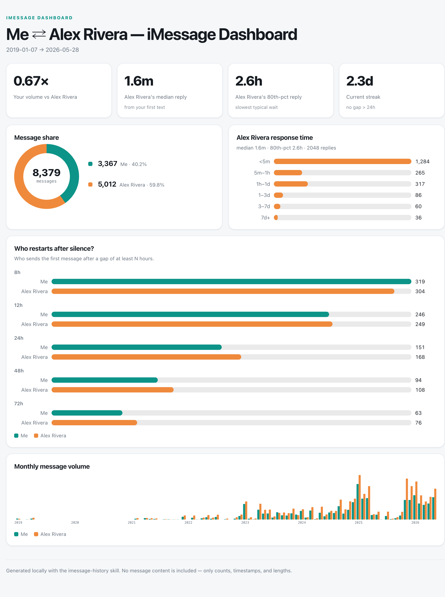

# imessage-history

Ask your AI agent questions about your macOS iMessage history. Runs
locally, reads your chat database directly, and never leaves your
machine. Stdlib Python under the hood, zero install, zero dependencies.



*A dashboard the skill generated for a 1:1 thread (contact name anonymized). See [Dashboards](#dashboards).*

## What you can do

Pull up exactly what was said, when, and by whom, across years of
chats, including group chats with phones, emails, and SMS contacts
mixed together. Useful for:

- **Recall.** "Where did Alex say to meet on Friday?"
- **Citation.** "Pull the back-and-forth around the night we picked
  the restaurant."
- **Audit.** "Every photo shared in the family chat last summer."
- **Rhythm.** "How often do I text my partner? When was our longest
  quiet stretch?"
- **Dashboards.** "Build me a dashboard of my texting patterns with my
  brother" — a self-contained HTML page of response times, who texts
  first, streaks, and volume over time. Quantitative dashboards include
  no message content; an optional narrative mode adds quoted highlights.

The Mac Messages app shows you one chat at a time and stops scrolling
after a few months. This skill searches the underlying database
exhaustively, decodes the message format Apple actually uses today,
and returns every match in a date range. No silent truncation, no
hidden limits.

## How to use it

Drop the skill into any AI agent that follows the
[Agent Skills spec][spec] — Claude Code, Cursor, Codex, and others
all work. Then ask in plain English:

```
Summarize what the family chat said about Thanksgiving plans last fall.
When did Alex first send me their new address?
Pull the back-and-forth around the night we picked the restaurant.
How active is the family group chat day by day?
Build me a dashboard of my texting patterns with Alex.
```

The agent picks the right query, runs the script locally, and gives
you the answer. You don't memorize flags. You don't think about SQL.

[spec]: https://agentskills.io/specification

## Dashboards

Turn a one-on-one thread into the dashboard at the top of this README —
response times, who texts first, double-texting, conversational streaks, and
volume over time. Just ask:

```
Build me a dashboard of my texting patterns with Alex.
How responsive is Alex compared to me? Make it a dashboard.
Visualize my thread with Alex over the last year.
```

The agent finds the 1:1 chat, computes the metrics locally, renders a
self-contained HTML page, and opens it in your browser. The standard
dashboard is **content-free** — only counts, timestamps, and message lengths,
never message text. Ask for a *"field report"* to add an interpretive layer
(themes, a narrative arc, and quoted highlights); that variant embeds real
quotes, so treat the file as private.

Dashboards are **1:1 only** (response time and who-restarts are inherently
pairwise). Under the hood it's two subcommands — `metrics` (numbers as JSON)
and `dashboard` (the HTML):

```fish
# find the 1:1 chat_id, then render + open
python3 scripts/imessage.py chats --participant "Alex"
python3 scripts/imessage.py dashboard <chat_id> --theme light --out ~/Desktop/alex.html
open ~/Desktop/alex.html
```

Pick a subset with `--modules`, switch to `--theme dark`, or pass
`--annotations notes.json` for the narrative layer. Run
`python3 scripts/imessage.py dashboard --help` for all flags.

## Privacy & safety

Designed to be opened, used, and put away without anything leaving
your machine.

- **Local only.** Reads `~/Library/Messages/chat.db` directly.
  Nothing is uploaded, no API key is required, no telemetry is
  collected. The script makes zero network calls.
- **Read-only.** SQLite is opened in `mode=ro`. The script cannot
  modify your messages even if it tried.
- **No dependencies.** Stdlib Python only. No `pip install`, no
  third-party libraries that could phone home.
- **You control where output goes.** Results print to stdout. If you
  pipe them into another tool (a cloud LLM, a pastebin, etc.), that's
  an explicit choice. Be intentional.
- **Custom contact names are gitignored.** If you create
  `contacts.json` to rename a handle, it's excluded from version
  control by default.
- **Generated dashboards are gitignored.** Quantitative dashboards are
  content-free, but narrative dashboards embed quoted messages, so
  `*.html` output is excluded from version control by default. Share
  generated files intentionally.

You'll need to grant **Full Disk Access** to whatever process runs
the script (Terminal, iTerm, Ghostty, VS Code, etc.) because
`chat.db` lives in a TCC-protected location. See [Install](#install)
below for the one-time setup.

## Install

Pick whichever flow you prefer. All three install the same content.

### `npx skills` (recommended)

Easiest for newcomers. Works across Claude Code, Cursor, Codex via
Vercel's [`skills`][vercel-skills] CLI:

```fish
npx skills add dalberto/imessage-history-skill
# pin to a release:
npx skills add dalberto/imessage-history-skill#v0.1.0
```

[vercel-skills]: https://github.com/vercel-labs/skills

### `git clone`

Drop the repo straight into your AI agent's skills directory:

```fish
git clone https://github.com/dalberto/imessage-history-skill ~/.claude/skills/imessage-history
```

(Substitute `~/.cursor/skills/` or wherever your agent looks.)

### `dotagents` (declarative)

If you manage skills through [`@sentry/dotagents`][dotagents]:

```fish
npx @sentry/dotagents add dalberto/imessage-history-skill imessage-history
```

[dotagents]: https://github.com/getsentry/dotagents

### Grant Full Disk Access (one-time)

1. Open **System Settings → Privacy & Security → Full Disk Access**.
2. Add your terminal app (Terminal, iTerm, Ghostty, VS Code, etc.).
3. Restart that terminal app after adding it.

Without Full Disk Access you'll get `unable to open database file`.

## Custom contact names

Contacts are resolved automatically from your macOS Address Book, so
most people don't need to configure anything. If a handle isn't in
Address Book, or you want a nickname, copy `contacts.example.json` to
`contacts.json` at the repo root:

```json
{
  "me": "YourName",
  "+15551234567": "Alex Example",
  "alex@example.com": "Alex Example"
}
```

The `me` key controls how your own messages are labeled (default:
`Me`). Everything else overrides or supplements Address Book. Keys
use the raw `handle.id` value from chat.db: phone numbers in
`+15551234567` form, emails as-is.

`contacts.json` is gitignored; `contacts.example.json` is the shipped
template. Pass `--contacts /path/to/file.json` to use a different
override file.

## Under the hood

The AI agent is just a friendly front-end. Underneath, this skill is
a stdlib Python script (`scripts/imessage.py`, plus a sibling
`scripts/dashboard.py` and an editable HTML/CSS shell at
`templates/dashboard.html`, used only for rendering dashboards) that you
can also run directly:

```fish
# Find the family group chat
python3 scripts/imessage.py chats --name "family"

# How often do I text Alex? What's our longest quiet stretch?
python3 scripts/imessage.py chats --participant "Alex Example"
python3 scripts/imessage.py stats 42

# Where did Alex say to meet on Friday?
python3 scripts/imessage.py search -k "Friday" --from "Alex Example"

# Did anyone in this chat recommend a dentist last fall?
python3 scripts/imessage.py search --chat-id 42 -k "dentist" \
    --since 2025-09-01 --until 2025-12-01

# Pull the thread around the night we picked the restaurant
python3 scripts/imessage.py window 42 "2026-04-12 19:30" --before 5 --after 30

# Every photo shared in the family chat since June
python3 scripts/imessage.py attachments 42 --mime-like image --since 2025-06-01

# That address Alex sent a while back, as JSON for piping
python3 scripts/imessage.py search -k "Bedford" --from "Alex Example" --format ndjson

# Build a dashboard of my texting patterns with Alex (1:1 chat)
python3 scripts/imessage.py dashboard 42 --theme light --out alex.html
```

Phone numbers and emails are resolved to the names in your macOS
Address Book, so output reads `[2026-04-15 19:00:47] Alex Example:
"..."` instead of `+15551234567`. Every content-returning subcommand
accepts `--format {text,json,ndjson}`. Run
`python3 scripts/imessage.py <subcommand> --help` for the full flag
list.

### Subcommands

| Subcommand | What it does |
| --- | --- |
| `chats` | List chats, filter by name / handle / participant, optionally count only within a date range. |
| `participants` | Roster of a chat with per-chat message counts. |
| `stats` | Per-sender counts, median length, weekday + hour histograms, longest dormancy. |
| `search` | Keyword search, scoped or global. `-k` repeatable (OR by default, `--all` for AND). `-K` excludes. `--from` / `--not-from` filter by sender name or handle substring. `--regex` post-filters. |
| `window` | All messages in a ±window around a timestamp. Reply-chain recovery. |
| `dump` | Every message in a chat over a date range, with the same filters as `search`. |
| `anchor-sweep` | Keyword search then auto-window and merge, returning contiguous passages with anchors marked. |
| `attachments` | List attachments in a chat over a range. |
| `reactions` | Surface tapbacks (normally filtered) with their target messages. |
| `metrics` | 1:1 relationship metrics (response time, share, who-restarts, double-texting, streak, monthly volume) as JSON. Content-free. |
| `dashboard` | Render a self-contained HTML dashboard for a 1:1 chat. `--theme light/dark`, `--out`, `--modules`, and `--annotations` for an optional narrative layer. |

### Why this needs to be a script

`chat.db` is a real SQLite database, but ad-hoc SQL against it is a
trap. Two gotchas catch most people:

1. **`message.text` is mostly NULL on modern macOS.** Content lives
   in an Apple-internal binary blob (`attributedBody`), and SQLite's
   default `CAST` truncates at the first NUL byte. This script
   decodes the blob in Python.
2. **Convenience wrappers silently cap results.** Many tools apply a
   `LIMIT` *after* the date filter. This script never does.

For the full schema map, decoding details, and other gotchas, read
[`references/chatdb_schema.md`](references/chatdb_schema.md).

## Limitations

- **macOS only.** iMessage history uses macOS-specific paths and
  schemas.
- **Apple's internal schema.** The script depends on column names and
  typedstream layout that Apple can change in major macOS updates.
  Tested on macOS 13–14; later versions may need adjustments.
- **Address Book schema drift.** The script reads
  `AddressBook-v22.abcddb` via the `ZABCDRECORD` / `ZABCDPHONENUMBER`
  / `ZABCDEMAILADDRESS` tables. Different macOS versions may vary.
- **SMS / iMessage / RCS aren't distinguished** in output. The
  `service` column is shown in `participants` but not filtered on.
- **Phone normalization is US-friendly.** The last-10-digits strategy
  works for NANP numbers. International numbers are compared by
  normalized form (digits only).
- **`text` fallback.** A handful of older messages may still have
  `text` populated while `attributedBody` is NULL. The script reads
  `text` when `attributedBody` decoding returns empty.

## Evals

Two eval sets live under `evals/`:

- **`trigger_evals.json`** — 20 should-trigger and should-not-trigger
  queries for tuning the AI-agent description. Synthetic, runnable
  by anyone.
- **`evals.json`** — execution test cases. Uses `<GROUP_NAME>` /
  `<CONTACT_NAME>` / `<TOPIC>` placeholders; substitute your own
  values before running against your `chat.db`.

## License

MIT — see [`LICENSE`](LICENSE).
